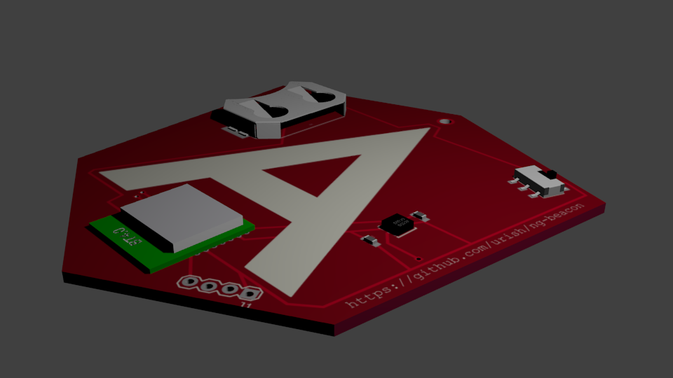

# ng-beacon

[Physical Web Beacon](https://medium.com/@urish/exploring-the-physical-web-without-buying-beacons-efae51e36c2e) shaped after the [Angular](https://angular.io) logo

Copyright (C) 2016, Uri Shaked

## Features

- Physical Web (Eddystone) Beacon
- Bluetooth Low Energy
- Built in Temperatue and Humidity Sensor

Wish list for 2017:

- Web Bluetooth Demos
- Optional Accelerometer, Magnetometer, Gyroscope
- Light Sensor
- Make it programmable via JavaScript
